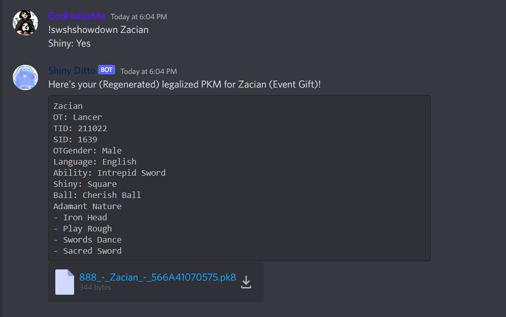
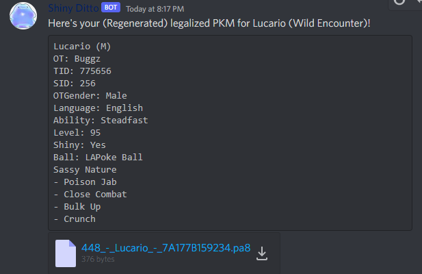

# OTHER COMMANDS

## Cancel Trade / Clear yourself from the Queue

**Note: If the bot is trying to trade with you or just starts your trade, it will not cancel it.**

- SWSH - `!swshqc`
- BDSP - `!bdspqc`
- PLA - `!plaqc`

<hr>

## Generate Showdown Set

*(Discord Only)*

This is helpful incase your not sure what move or ability to add to a Pokémon or just want something created for you fast.

Commands for each Bot (Remember to use the proper channels for this)
- SWSH - `!swshshowdown PokemonName`
- BDSP - `!bdspshowdown PokemonName`
- PLA - `!plashowdown PokemonName`

In addiction if you want it to generate the pokemon using this, then some other things you can do is add things like this below.

- `Shiny: Yes`
- `Ball: Master Ball`
- `Level: 65`

**Example:**
--------------------------
```
!swshshowdown Charizard
Shiny: Yes
```


<hr>

### Convert a Pokémon to a showdown set or to get the `.pk8, .pb8, .pa8` file.

*(Discord Only)*

Commands for each Bot (Remember to use the proper channels for this)
- SWSH - `!swshconvert`
- BDSP - `!bdspconvert`
- PLA - `!placonvert`

**Example:**
```
!placonvert Lucurio 
Shiny: Yes 
Alpha: Yes
Level: 95
```



<hr>

### Trainer Info 

*How to get your TID and SID and your OT*
so you can add it to pokemon you get from the bot.  You will need to send the file in either #💎bdsp-bot🔮 , #🌀pla-bot , or  #🗡swsh-bot🛡 channels)

Catch a random pokemon the game that you want your TID and SID from, make a trade with the bot and trade that pokemon that you just caught. In your DMs from @Shiny Ditto , you should get a  pb8 file  for BDSP , .pk8 file for SWSH , or .pa8 file for PLA. Next go to the correct channel for either SWSH, LOA, or BDSP and send that file by itself with out any commands. Then the bot should send you a message back like this 

```
Unown-?
OT: BuggzEvol
TID: 276158
SID: 200
OTGender: Male
Language: English
IVs: 0 HP / 0 Atk / 0 Def / 0 SpA / 0 SpD / 0 Spe
Ability: Levitate
Level: 25
Shiny: Yes
Ball: LAGreat Ball
Hardy Nature
- Hidden Power [Fighting]
```

**NOTES:**
There you will see your TID & SID (for SID if you only see 3 digits the  you need to add a 0 infront of it.


<hr>
